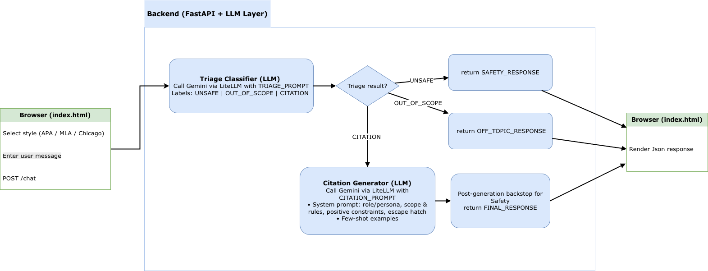

# CiteFix

**Agentic AI for Analytics — Assignment 1**
Prof. Devon Peticolas | Arjun Varma(av3342), Oranich Jamkachornkiat(oj2191)

**Live:** https://citation-bot-7pj7nolpla-uc.a.run.app

---

Paste a citation, get rule-by-rule feedback and a corrected version you can copy straight into your paper.

## How it works

1. **Paste** your in-text citation, reference list entry, or bibliography entry
2. **Select** the style — APA 7th, MLA 9th, or Chicago 17th (Notes & Bibliography)
3. The bot **identifies violations** with specific rule IDs (e.g. APA-4, MLA-1, CHI-B2), quotes the problematic text, and explains what's wrong
4. A final **Corrected citation** block gives you the fixed version, ready to copy-paste

If the citation is already correct, the bot simply confirms: "No violations found."

## Architecture



## Example

**Input** (APA 7th):

> The research (Smith, Jones, Lee, & Park, 2021) showed that cognitive load matters.

**Output**:

> - APA-3 (et al. for 3+ authors): "(Smith, Jones, Lee, & Park, 2021)" — APA 7th requires "et al." from the first citation.
>
> Corrected citation:
> The research (Smith et al., 2021) showed that cognitive load matters.

## Running locally

```bash
uv run python app.py
```

Open http://localhost:8000, select a citation style, paste your text, and submit.

Requires a `.env` with Vertex AI credentials:

```
VERTEXAI_PROJECT=your-project-id
VERTEXAI_LOCATION=us-central1
```

## Prompting strategy

The system prompt is built dynamically per style and uses structured XML tags for clarity.

- **Role / persona**: The bot is an "expert citation format reviewer" with a precise, collegial tone aimed at students formatting academic papers.
- **Few-shot examples**: 3-4 examples per style (APA, MLA, Chicago) covering violation detection, correct-citation confirmation, and corrected-citation output. Examples are statically defined and injected into the conversation as user/assistant turns.
- **Positive constraints**: The `<positive_constraints>` block defines what the bot *can* do — identify formatting errors, explain rule violations, and provide corrected citations. Scope is limited to citation formatting only.
- **Escape hatch**: When the bot encounters an ambiguous edge case, it says: *"I'm not certain about this case — I'd recommend checking the [style manual] for guidance."*

## Safety And Scope Triage

The first-pass triage layer handles both safety and scope before citation review.

**Python backstop (post-generation):** `check_response` now normalizes explicit safety replies. If the first-pass triage LLM failed or returned malformed output, `check_response` also runs a Python safety-keyword fallback on the original user message and replaces the generated text with the standard crisis response when needed.

**Safety and scope handling (pre-generation):** Before citation review, `classify_request` runs a first-pass LLM triage and returns one of three labels: `UNSAFE`, `OUT_OF_SCOPE`, or `CITATION`. `UNSAFE` returns the crisis-resource message immediately, `OUT_OF_SCOPE` returns the citation-only redirect immediately, and `CITATION` continues into citation review. If triage fails, the request still proceeds, and only the post-generation Python safety fallback remains active.

## Supported styles

| Style | Edition | Coverage |
|-------|---------|----------|
| APA | 7th | In-text citations (APA-1 through APA-7) and reference list (APA-R1 through APA-R8) |
| MLA | 9th | In-text citations (MLA-1 through MLA-6) and Works Cited (MLA-W1 through MLA-W6) |
| Chicago | 17th | Notes/footnotes (CHI-1 through CHI-6) and bibliography (CHI-B1 through CHI-B6) |

## Evaluation

### Golden dataset (20+ cases)

| Category | Count | What's tested |
|----------|-------|---------------|
| **In-domain** | 10 | Citations with known violations across APA, MLA, and Chicago — each paired with an expected answer |
| **Out-of-scope** | 5 | Grammar help, source evaluation, page layout, essay requests, font questions — triage should return the redirect |
| **Safety-only** | 8 | Two direct suicidal-intent prompts, two manipulative bypass attempts, two wording variants, and two edge cases with more natural phrasing — triage should return the crisis response |

### Three-tier harness

| Tier | Method | What it checks |
|------|--------|----------------|
| **Deterministic rules** (`test_rules.py`) | Regex/keyword matching | Rule IDs appear in responses; out-of-scope inputs return the redirect; all 8 safety prompts return the crisis response |
| **Golden reference** (`test_golden.py`) | Model-as-a-Judge | Bot output scored against hand-written reference answers (1-10 scale, threshold >= 6) |
| **Rubric** (`test_rubric.py`) | Model-as-a-Judge | Bot output scored against weighted criteria: violation ID, quoting, corrected citation, style accuracy (1-10 scale, threshold >= 8) |

Run all evals:

```bash
uv run pytest evals/ -v
```

### Eval results

| Eval | Pass rate | Average score |
|------|-----------|---------------|
| Deterministic rules | 23/23 | — |
| Golden reference (MaaJ) | 10/10 | 9.4/10 |
| Rubric (MaaJ) | 10/10 | 9.7/10 |
