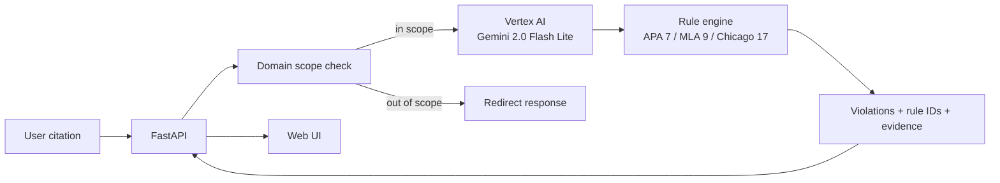

# Citation Format Checker

Narrow-domain chatbot that identifies APA 7 / MLA 9 / Chicago 17 citation violations with rule-IDs and quoted evidence. Won't rewrite your citation — tells you exactly what's wrong and why.

- **Live demo:** https://citation-bot-7pj7nolpla-uc.a.run.app
- **Portfolio:** https://arjun-varma.com/
- **Built at:** Columbia University · 2026

## Problem

Academic citation formatting is tedious and error-prone. Students and researchers must navigate hundreds of rules across APA 7th, MLA 9th, and Chicago 17th — each with subtle differences for different source types. Existing tools auto-rewrite citations, which masks the underlying error instead of teaching the writer.

Goal: a specialized chatbot that identifies specific formatting violations in citations and reference lists, with rule-based evidence, without rewriting the user's text.

## Challenge

- Each citation style has hundreds of rules with subtle differences (comma placement, italicization, date formats)
- The bot must identify specific violations with rule IDs, not just suggest generic corrections
- Must stay narrowly scoped — redirect off-topic questions about grammar, research quality, or page layout
- Requires safety backstops for crisis-language detection
- Evaluation is complex — needs both deterministic checks and model-as-judge approaches

## Approach

1. **Domain scoping** — explicit boundary (citation and reference formatting only) with redirect logic for out-of-scope queries
2. **Rule engineering** — formatting rules for all three styles encoded with specific rule IDs for traceable violation reporting
3. **Vertex AI integration** — Gemini 2.0 Flash Lite for fast, cost-effective responses with domain-specific prompting
4. **Comprehensive evaluation** — multi-layered eval harness: deterministic checks, golden-reference comparisons, rubric-based model-as-judge scoring

## Solution / Architecture


```mermaid
flowchart LR
    U[User citation] --> API[FastAPI]
    API --> DS[Domain scope check]
    DS -->|in scope| VX[Vertex AI<br/>Gemini 2.0 Flash Lite]
    DS -->|out of scope| RD[Redirect response]
    VX --> RE[Rule engine<br/>APA 7 / MLA 9 / Chicago 17]
    RE --> V[Violations + rule IDs + evidence]
    V --> API
    API --> UI[Web UI]
```

**Components:**

- **FastAPI backend** — RESTful API with session management
- **Vertex AI integration** — Gemini 2.0 Flash Lite with citation-domain prompts
- **Web interface** — clean UI with style selector (APA / MLA / Chicago) for paste-and-check workflow
- **Evaluation suite** — pytest harness with three test types:
  1. Deterministic rule detection
  2. Golden-reference model-as-judge
  3. Rubric-based model-as-judge
- **Cloud Run deployment** — containerized on GCP with public access

Every violation cites a specific rule ID and quotes evidence directly from the user's text.

## Impact / Results

- Supports APA 7th, MLA 9th, Chicago 17th
- Identifies specific violations with rule IDs and quoted evidence — not black-box rewrites
- Deployed on GCP Cloud Run with public access
- 30+ eval test cases across three evaluation methods
- Narrow domain focus with graceful out-of-scope handling
- Safety backstops for sensitive content

## Tech Stack

Python · FastAPI · Vertex AI · Gemini 2.0 Flash Lite · Google Cloud Run · Docker · pytest

## Run Locally

```bash
git clone https://github.com/ARJUNVARMA2000/citation-format-checker.git
cd citation-format-checker
cp .env.example .env   # add GOOGLE_APPLICATION_CREDENTIALS
pip install -r requirements.txt
uvicorn app.main:app --reload
# open http://localhost:8000
```

Run evals:

```bash
pytest tests/evals/
```

## License

MIT
